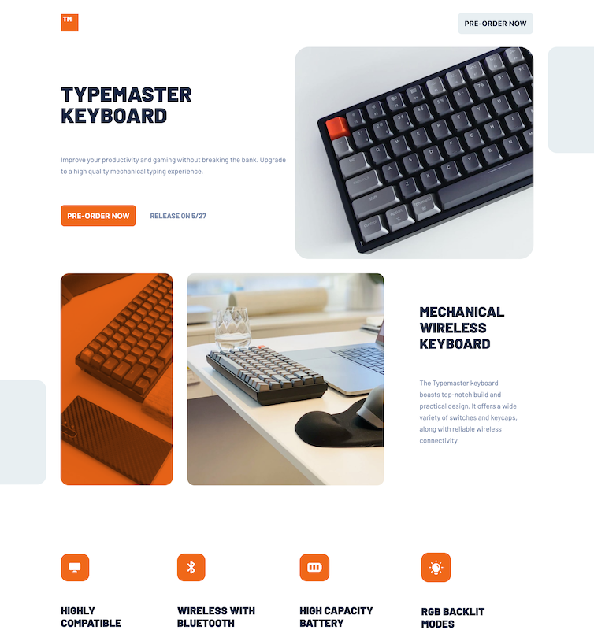
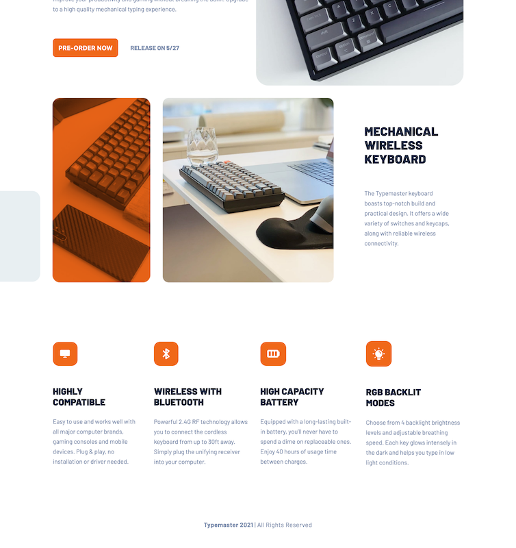
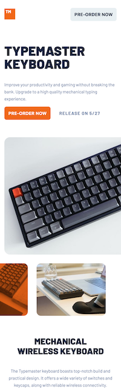

# Frontend Mentor - Typemaster pre-launch landing page solution

This is a solution to the [Typemaster pre-launch landing page challenge on Frontend Mentor](). Frontend Mentor challenges help you improve your coding skills by building realistic projects.

## Table of contents

- [Frontend Mentor - Typemaster pre-launch landing page solution](#frontend-mentor---typemaster-pre-launch-landing-page-solution)
  - [Table of contents](#table-of-contents)
  - [Overview](#overview)
    - [The challenge](#the-challenge)
    - [Screenshot](#screenshot)
    - [Links](#links)
  - [My process](#my-process)
    - [Built with](#built-with)
  - [Author](#author)
 

## Overview

### The challenge

Users should be able to:

- view the app in various sizes
- can navigate the CTA button with ease.
- see the information display easily

### Screenshot

### Links

- Solution URL: [https://github.com/RioCantre/typemaster-pre-launch](https://github.com/RioCantre/typemaster-pre-launch)
- Live Site URL: [https://typemaster-pre-launch.netlify.app/](https://typemaster-pre-launch.netlify.app/)

## My process

### Built with

- Semantic HTML5 markup
- CSS custom properties
- Flexbox
- SaSS
- Mobile-first workflow

## Author

- Website - [Rio Cantre](https://riocantre.netlify.app/)
- Frontend Mentor - [@RioCantre](https://www.frontendmentor.io/profile/RioCantre)
- Twitter - [@CantreRio](https://twitter.com/CantreRio)

